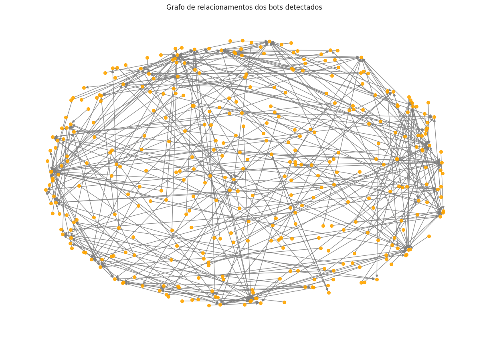
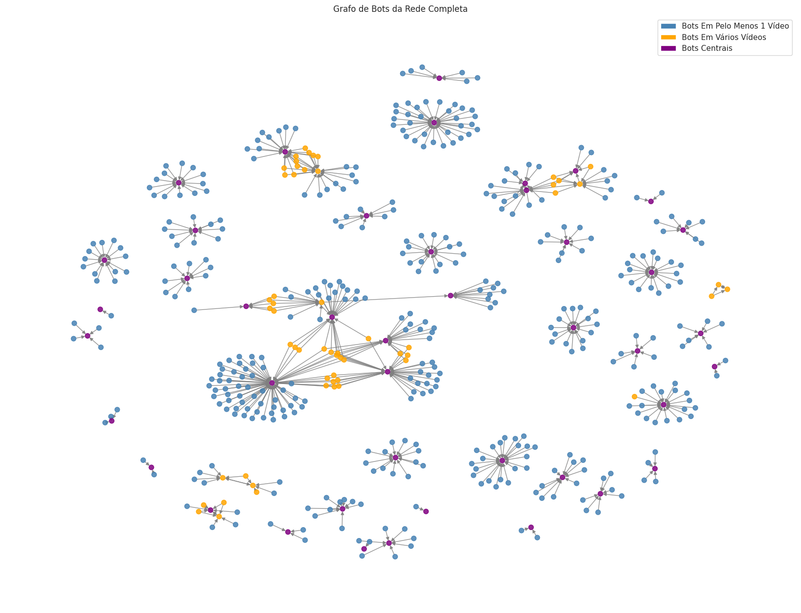
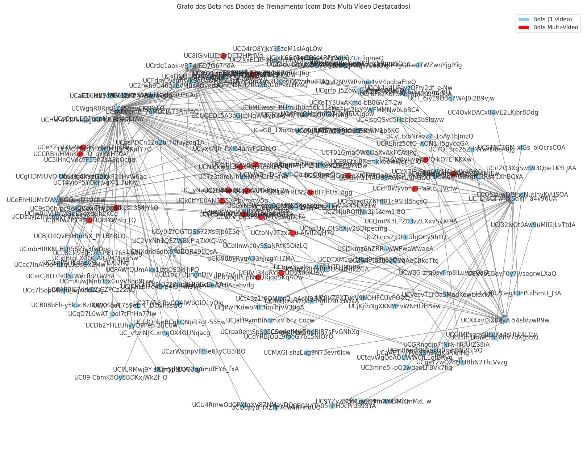

# 🧠 Classificador de Bots em Comentários do YouTube

Este projeto tem como objetivo identificar **grupos de bots** em comentários de vídeos do YouTube, utilizando **técnicas de pré-processamento, análise de redes e modelos de aprendizado de máquina**.

Durante a execução do projeto, realizamos todo o pipeline de construção de um modelo de IA, desde a **coleta dos dados via API do YouTube**, passando por **filtragens, adição de rótulos, extração de features**, até a **construção, validação e teste do modelo**.

---

## 📌 Principais Etapas do Projeto

1. **Coleta de dados**: Utilizando a API do YouTube, coletamos comentários de vídeos, incluindo respostas.
2. **Pré-processamento**: Limpeza, organização e estruturação dos dados em formatos adequados para análise.
3. **Engenharia de Atributos**: Criação de atributos a partir dos metadados dos comentários e usuários.
4. **Rotulagem**: Identificação manual de grupos suspeitos como bots e criação de labels para o treinamento supervisionado.
5. **Criação e Treinamento do Modelo**: Construção de modelos de classificação utilizando Python e frameworks de IA, com parte do trabalho executado no Google Colab.
6. **Visualização de Redes**: Geração de grafos que representam interações suspeitas entre usuários, facilitando a identificação de comportamentos automatizados.

---

## 🧪 Tecnologias Utilizadas

- **Python**: linguagem base do projeto
- **Google Colab**: ambiente para desenvolvimento e testes dos modelos
- **YouTube Data API v3**: coleta de comentários
- **Pandas / NumPy**: manipulação de dados
- **Scikit-learn**: construção e avaliação dos modelos
- **Matplotlib / NetworkX**: visualização de grafos e dados

---

## 📁 Estrutura do Projeto

```bash
.
├── comentarios_baixados/            # Comentários brutos coletados da API
├── comentarios_com_replies/         # Comentários com suas respostas
├── comentarios_padrao_csv/          # Dados processados em formato CSV
├── resources/                       # Imagens e artigo gerado
├── yt_comments_env/                 # Ambiente virtual para execução local
├── classificacao_bots.py            # Script principal de classificação
├── json_to_csv.py                   # Conversão de JSONs para CSV
├── main.py                          # Execução completa do pipeline
├── separar_bots.py                  # Lógica de separação dos usuários bots
├── unir_jsons.py                    # União de arquivos JSON coletados
├── requirements.txt                 # Dependências do projeto
└── README.md
```

## Como Executar
```bash

python -m venv yt_comments_env
source yt_comments_env/bin/activate  # Linux/macOS
yt_comments_env\Scripts\activate     # Windows

```

## Instalar dependências
```bash
pip install -r requirements.txt
```

## 📊 Resultados

A seguir, algumas visualizações de redes de interação entre usuários obtidas a partir dos dados analisados:

### 📌 Grupos de bots por segmento de vídeo

Arquivo: `redes_bots_por_seguimento.png`



---

### 📌 Rede completa com todos os bots identificados

Arquivo: `rede_bots_completa.png`



---

### 📌 Rede com todos os bots identificados rotulados

Arquivo: `rede_bots_com_labels.png`



---

### 📄 Artigo PDF com o estudo sobre o projeto

Arquivo: `artigo_gerado.pdf`

📥 [Clique aqui para visualizar ou baixar o artigo](./resources/artigo_gerado.pdf)
